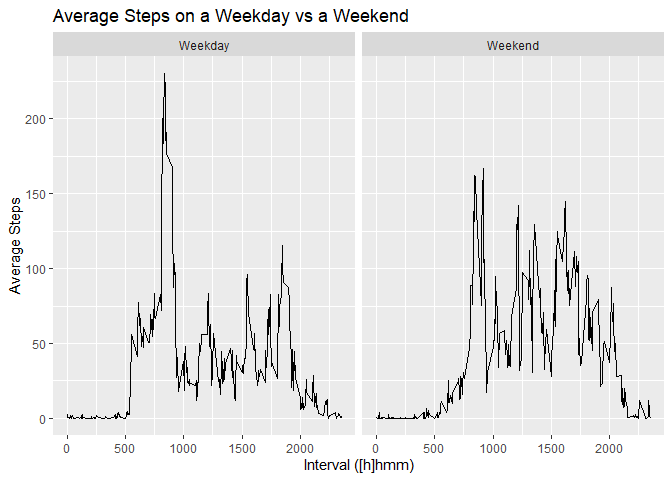

## Loading and preprocessing the data
#### Tasks Performed

- Set global options for number format
- Load libraries required for data manipulation and graphing
- Read the file into a dataframe, unzipping in the process.  
- File format is such that standard read.csv parameters are sufficient. 
- Check data structure to be sure all is as expected


```r
options(scipen=999)
library(dplyr)
library(ggplot2)
```


```r
activity <- read.csv(unzip("activity.zip"))
str(activity)
```

```
## 'data.frame':	17568 obs. of  3 variables:
##  $ steps   : int  NA NA NA NA NA NA NA NA NA NA ...
##  $ date    : Factor w/ 61 levels "2012-10-01","2012-10-02",..: 1 1 1 1 1 1 1 1 1 1 ...
##  $ interval: int  0 5 10 15 20 25 30 35 40 45 ...
```

***

## What is mean total number of steps taken per day?
#### Tasks Performed

- Sum the steps by day, ignoring the NA values
- Calculate the mean and median of the daily totals
- Show a histogram of the daily totals (cuts total steps into buckets and counts number of days for each bucket)


```r
byday <- activity %>% group_by(date) %>% summarise(steps = sum(steps, na.rm = TRUE))
mean <- mean(byday$steps)
median <- median(byday$steps)
hist(byday$steps, breaks = 10, xlab = "Total Steps", main = "Histogram of Total Steps per Day")
```

<!-- -->

The mean daily step count is: 9354.2295082  
The median daily step count is: 10395

***

## What is the average daily activity pattern?
#### Tasks Performed

- Calculate the average steps per interval across all days
- Find the maximum interval
- Plot the interval pattern as a line chart.


```r
byinterval <- activity %>% group_by(interval) %>% summarise(steps = mean(steps, na.rm = TRUE))
maxtime <- byinterval[which.max(byinterval$steps),1]
plot(byinterval$interval, byinterval$steps, type = "l", xlab = "Interval ([h]hmm)", ylab = "Average Steps", main = "Average Steps by Interval")
```

<!-- -->

The timeslot with the highest average steps is: 835

***

## Imputing missing values
#### Tasks Performed

- Establish how many values are missing and roughly what % of the dataset that is.
- Replace the missing values with the mean of the populated values for that timeslot.
- Repeat the histogram above and calculate the new mean and median.


```r
totalmissing <- sum(is.na(activity$steps))
percentmissing <- as.integer(mean(is.na(activity$steps)) * 100)
```

The total number of values is 2304 which is roughly 13% of the dataset.


```r
activity2 <- activity %>% group_by(interval) %>% mutate(steps = ifelse(is.na(steps),mean(steps, na.rm = TRUE), steps)) 
byday2 <- activity2 %>% group_by(date) %>% summarise(steps = sum(steps))

mean2 <- mean(byday2$steps)
median2 <- median(byday2$steps)
hist(byday2$steps, breaks = 10, xlab = "Total steps", main = "Histogram of Total Steps per Day")
```

<!-- -->

The new mean daily stepcount is: 10766.1886792  
The new median daily stepcount is: 10766.1886792

***

## Are there differences in activity patterns between weekdays and weekends?
### Tasks performed

- Create new indicator for weekday vs weekend
- Plot the average steps per interval on a weekday vs a weekend


```r
weekend <- c("Saturday", "Sunday")
byweekend <- activity2 %>% mutate(date = ifelse(weekdays(as.Date(date)) %in% weekend, "Weekend", "Weekday")) %>%
             group_by(date, interval) %>% summarise(steps = mean(steps)) %>% ungroup()

g <- ggplot(byweekend, aes(interval, steps))
g + geom_line() + facet_grid(.~ date) + labs(x = "Interval ([h]hmm)", y = "Average Steps", title = "Average Steps on a Weekday vs a Weekend")
```

<!-- -->
